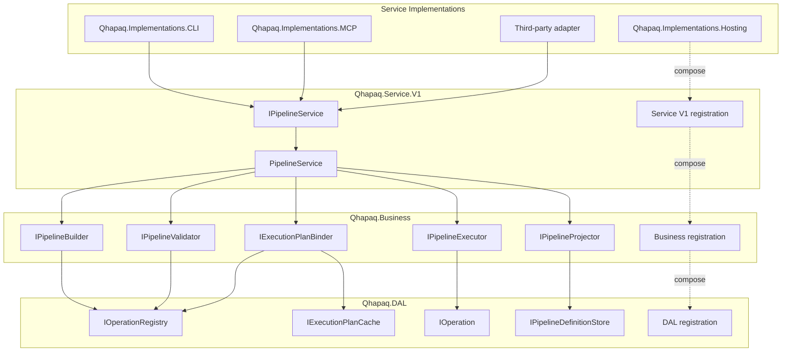

# SPEC-0006: .NET Layered Architecture

> **Status:** Draft
> **Target:** Initial .NET 10 implementation
> **Last updated:** 2026-10-04

## 1. Summary

The .NET reference implementation uses four logical layers:

1. **Service Implementations** provide user-facing entry points such as the CLI
   and MCP server.
2. **Service** normalizes every entry point into a common, explicitly versioned
   application contract.
3. **Business** constructs, validates, binds, and executes pipelines through
   reusable domain components.
4. **Data Access Layer (DAL)** provides primitive operations, decorators,
   registries, and low-level adapters used by the business layer.

Production calls move down exactly one layer at a time and cross each boundary
through constructor-injected contracts. The Service Implementations layer must
not call Business or DAL components. Service must not call DAL components.
Business must not call Service Implementations or Service components.

Each layer has one or more matching .NET assemblies rooted at `Qhapaq`.
Assembly boundaries are independent from the smaller public NuGet package
surface established by
[`0001-core-pipeline-model.md`](0001-core-pipeline-model.md); a NuGet package
may contain multiple Qhapaq assemblies.

## 2. Goals

- Give CLI, MCP, future gRPC, and third-party entry points one consistent
  application boundary.
- Permit breaking application-contract changes through side-by-side service
  versions rather than coordinated changes to every entry point.
- Enforce dependency direction through contracts, dependency injection,
  visibility, assembly references, and architecture tests.
- Make the owning layer apparent from every production assembly and root
  namespace.
- Keep pipeline construction and execution rules reusable and independent of
  transports and hosts.
- Minimize the public .NET API while preserving supported operation authoring
  and third-party entry-point scenarios.
- Preserve the portable, language-neutral contracts defined by the root
  specifications and schemas.

## 3. Non-goals

- This specification does not make internal .NET layer contracts portable
  Qhapaq contracts.
- It does not define the normative CLI, MCP, or future gRPC wire protocols.
- It does not create separate public `Service`, `Business`, or `DAL` packages.
- It does not permit declarative documents to select implementation types.
- It does not introduce remote execution, durable runs, or implicit operation
  version selection.

## 4. Layer Responsibilities

### 4.1 Service Implementations

Service Implementations are adapters at the top of the call graph. Initial
implementations are the `qhapaq` CLI and MCP server, implemented by
`Qhapaq.Implementations.CLI` and `Qhapaq.Implementations.MCP`; future
implementations may include `Qhapaq.Implementations.GRPC` or
application-specific adapters.

**[R-0006-001]** Each implementation:

- parses and authenticates its transport-specific request;
- maps that request to one exact version of the public Service contract;
- invokes only that Service contract;
- maps the Service result or structured failure to its own protocol; and
- contains no pipeline construction, binding, policy, or execution rules.

**[R-0006-002]** `Qhapaq.Implementations.Hosting` is the .NET hosting and composition adapter
used by entry points. It invokes the public Service V1 composition entry point
and must not reference or register Business or DAL components directly.

### 4.2 Service

**[R-0006-003]** Service is the common application boundary. It coordinates complete use cases
such as constructing, validating, visualizing, and executing a pipeline. It
normalizes entry-point inputs, applies application-level validation, invokes
Business contracts, and translates domain outcomes into stable service
outcomes.

**[R-0006-004]** Service contracts are versioned independently from NuGet packages, pipeline
document versions, and operation versions. Initial public contracts use the
`Qhapaq.Abstractions.Service.V1` namespace, and their implementation uses the
`Qhapaq.Service.V1` assembly and root namespace. A breaking contract change
adds a new contract namespace and side-by-side implementation assembly, such
as `Qhapaq.Service.V2`; it must not silently change V1 behavior.

**[R-0006-005]** The Service contract is public because third parties may create their own entry
points. It is an advanced integration boundary rather than a transport
protocol. Service implementations are internal and obtained through supported
dependency-injection registration.

### 4.3 Business

**[R-0006-006]** Business owns domain behavior that is independent of an entry point:

- pipeline construction and higher-level composition;
- semantic validation and type compatibility;
- definition-to-plan binding;
- policy evaluation orchestration;
- execution-plan and run coordination;
- canonical definition projections; and
- deterministic visualization and invocation-skill generation.

**[R-0006-007]** Business accepts only Service-to-Business abstraction types and calls only
Business-to-DAL abstraction types. It must not parse CLI arguments, MCP
messages, or other transport envelopes.

### 4.4 Data Access Layer

**[R-0006-008]** DAL is the lowest implementation layer. It owns:

- primitive `IOperation<TInput, TOutput>` implementations;
- operation decorators and wrappers;
- operation and decorator registration and exact-version lookup;
- low-level definition, plan-cache, and host-configuration adapters; and
- external resource adapters used by operations.

**[R-0006-009]** DAL does not make application-use-case decisions and does not call Business,
Service, or Service Implementation components. A primitive operation package
continues to depend only on `Qhapaq.Abstractions`.

## 5. Contract Placement and Visibility

**[R-0006-010]** All cross-layer interfaces and boundary object types are defined in
`Qhapaq.Abstractions`. Their visibility follows least exposure:

| Contract category | Visibility | Consumers |
| --- | --- | --- |
| Versioned Service interfaces, requests, results, and structured errors | `public` | Built-in and third-party Service Implementations |
| Operation execution and static descriptor-authoring contracts and essential operation value types | `public` | Primitive operation and decorator authors |
| Service-to-Business contracts and values | `internal` | Qhapaq implementation assemblies and tests |
| Business-to-DAL contracts and values | `internal` | Qhapaq implementation assemblies and tests |
| Concrete Service, Business, and DAL types | `internal` | Owning-layer registration and tests |

**[R-0006-011]** `InternalsVisibleTo` may grant named Qhapaq implementation and test assemblies
access to internal contracts. It must not grant access to third-party
assemblies, use a wildcard, or become a substitute for a deliberately public
contract.

**[R-0006-012]** Public contracts must not expose internal contract types, concrete
implementation types, dependency-injection container types, transport types,
or mutable implementation state. Portable JSON and protocol semantics remain
defined by schemas and language-neutral specifications rather than these CLR
types.

## 6. Dependency and Composition Rules

**[R-0006-013]** Each component receives required collaborators through constructor injection.
Service location, ambient mutable state, and runtime type-name activation are
prohibited.

**[R-0006-014]** The allowed runtime call graph is:

```text
Service Implementation -> Service -> Business -> DAL
```

**[R-0006-015]** The allowed contract dependencies are:

```text
Service Implementation -> public Service contracts
Service                -> internal Service-to-Business contracts
Business               -> internal Business-to-DAL contracts
DAL                    -> public operation contracts and platform abstractions
```

**[R-0006-016]** The .NET implementation uses `Microsoft.Extensions.DependencyInjection` as
decided by
[ADR-0001](../docs/architecture/decisions/0001-use-microsoft-dependency-injection.md).
Composition APIs use `IServiceCollection`; behavioral components must not
depend on `IServiceCollection`, `IServiceProvider`, or `IServiceScopeFactory`.
`Qhapaq.Abstractions` must not expose Microsoft DI types.

**[R-0006-017]** Composition follows the same adjacent-layer direction as runtime behavior:

```text
Qhapaq.Implementations.Hosting
    -> Qhapaq.Service.V1 registration
    -> Qhapaq.Business registration
    -> Qhapaq.DAL registration
```

**[R-0006-018]** Each layer registers its own internal concrete types, exposes only its boundary
abstractions for resolution, and delegates registration only to the immediately
lower layer. Hosting must not reference Business or DAL. Service must not
reference DAL. The Service V1 registration entry point is public so supported
hosting adapters can compose the versioned Service boundary. Business and DAL
registration entry points remain internal and are visible only to the named
adjacent Qhapaq assembly and tests.

**[R-0006-019]** Only an executable or hosting boundary may build or directly access the root
`IServiceProvider`. Registration methods must not build a nested provider,
resolve services, or invoke product behavior. Registration is explicit rather
than reflection-based assembly scanning. Hosts enable build and scope
validation in development and automated tests.

**[R-0006-020]** Cross-cutting concerns belong at the lowest layer that has the required
context. Transport diagnostics stay in Service Implementations, use-case
diagnostics stay in Service, domain diagnostics stay in Business, and
operation-specific diagnostics stay in DAL. Policy enforcement must not be
implemented only in a transport adapter.

## 7. Assemblies and Distribution Packages

**[R-0006-021]** Every production project sets `AssemblyName` and `RootNamespace` to its project
name. Initial production assemblies are:

| Assembly and root namespace | Layer | Distribution |
| --- | --- | --- |
| `Qhapaq.Abstractions` | Contracts shared across adjacent layers | `Qhapaq.Abstractions` NuGet package |
| `Qhapaq.Service.V1` | Service V1 | Bundled in the `Qhapaq` NuGet package |
| `Qhapaq.Business` | Business | Bundled in the `Qhapaq` NuGet package |
| `Qhapaq.DAL` | DAL | Bundled in the `Qhapaq` NuGet package |
| `Qhapaq.Implementations.Hosting` | Service Implementations and composition | `Qhapaq.Hosting` NuGet package |
| `Qhapaq.Implementations.MCP` | Service Implementations | `Qhapaq.Mcp` NuGet package and MCP host distribution |
| `Qhapaq.Implementations.CLI` | Service Implementations | Self-contained `qhapaq` executable distribution |

**[R-0006-022]** The `Qhapaq` NuGet package is a distribution package and does not require a
`Qhapaq.dll` facade assembly. Similarly, package names may remain stable when
their contained implementation assembly has a more precise layer-aligned name.
Adding a public package for an internal layer remains a separate compatibility
decision.

**[R-0006-023]** Future entry-point assemblies use the
`Qhapaq.Implementations.<Implementation>` pattern. Future breaking Service
versions use `Qhapaq.Service.V<Major>`. `CLI`, `MCP`, `DAL`, and similarly
established initialisms retain their canonical uppercase spelling in assembly
and root namespace names.

## 8. Initial .NET Project and File Plan

**[R-0006-024]** The initial project structure is:

```text
implementations/dotnet/
|-- Qhapaq.slnx
|-- Directory.Build.props
|-- Directory.Packages.props
|-- global.json
|-- src/
|   |-- Qhapaq.Abstractions/
|   |   |-- Qhapaq.Abstractions.csproj
|   |   |-- Operations/
|   |   |   |-- IOperation.cs
|   |   |   `-- Declarations/
|   |   |-- Service/V1/
|   |   |   |-- IPipelineService.cs
|   |   |   |-- Requests/
|   |   |   `-- Results/
|   |   `-- Internal/
|   |       |-- Business/
|   |       `-- DAL/
|   |-- Qhapaq.Service.V1/
|   |   |-- Qhapaq.Service.V1.csproj
|   |   `-- PipelineService.cs
|   |-- Qhapaq.Business/
|   |   |-- Qhapaq.Business.csproj
|   |   |-- Construction/
|   |   |-- Validation/
|   |   |-- Binding/
|   |   |-- Execution/
|   |   `-- Projection/
|   |-- Qhapaq.DAL/
|   |   |-- Qhapaq.DAL.csproj
|   |   |-- Operations/
|   |   |-- Decorators/
|   |   |-- Registries/
|   |   `-- Persistence/
|   |-- Qhapaq.Implementations.Hosting/
|   |   |-- Qhapaq.Implementations.Hosting.csproj
|   |   `-- DependencyInjection/
|   |-- Qhapaq.Implementations.MCP/
|   |   |-- Qhapaq.Implementations.MCP.csproj
|   |   `-- Service/
|   `-- Qhapaq.Implementations.CLI/
|       |-- Qhapaq.Implementations.CLI.csproj
|       |-- Commands/
|       `-- Service/
`-- tests/
    |-- unit/
    |   |-- Qhapaq.Architecture.Tests/
    |   |-- Qhapaq.Service.V1.Tests/
    |   |-- Qhapaq.Business.Tests/
    |   `-- Qhapaq.DAL.Tests/
    `-- integration/
        |-- Qhapaq.Implementations.Hosting.Tests/
        |-- Qhapaq.Implementations.MCP.Tests/
        `-- Qhapaq.Implementations.CLI.Tests/
```

**[R-0006-025]** Assembly references provide the primary structural boundary. Folder names and
namespaces communicate ownership within each assembly. Additional files should
be introduced only with behavior and tests, not as empty placeholders.

## 9. Initial Components

**[R-0006-026]** The names below define responsibilities and relationships for the initial
scaffold. Exact method and DTO shapes remain governed by the use-case and
protocol specifications created before implementation.

| Layer | Initial component | Responsibility |
| --- | --- | --- |
| Service Implementations | `Qhapaq.Implementations.CLI` commands | Map command input and output to Service V1 |
| Service Implementations | `Qhapaq.Implementations.MCP` handlers | Map MCP requests and results to Service V1 |
| Service Implementations | `Qhapaq.Implementations.Hosting` registrations | Compose and expose the supported Service boundary |
| Service | `IPipelineService` V1 | Public entry-point contract for pipeline use cases |
| Service | `PipelineService` V1 | Coordinate validation, construction, visualization, and execution |
| Business | `IPipelineValidator` | Apply semantic and type-compatibility validation |
| Business | `IPipelineBuilder` | Construct immutable pipeline definitions and higher-level compositions |
| Business | `IExecutionPlanBinder` | Bind an exact validated definition to an immutable plan |
| Business | `IPipelineExecutor` | Coordinate one non-durable run |
| Business | `IPipelineProjector` | Produce deterministic Mermaid and skill projections |
| DAL | `IOperationRegistry` | Resolve allowlisted operations and decorators by exact identity and version |
| DAL | `IPipelineDefinitionStore` | Persist and retrieve canonical definitions |
| DAL | `IExecutionPlanCache` | Cache derived bound plans without making them portable |
| DAL | `IOperation<TInput, TOutput>` | Execute a primitive or type-preserving decorated operation |

**[R-0006-027]** The declaration contracts planned under `Operations/Declarations/` let
registry-visible code-authored operations expose a static portable descriptor
without construction. A marker attribute may support analyzers and source
generators, but registration remains explicit and reflection-free. Exact API
shapes are governed by
[`0007-portable-pipeline-definitions-and-binding.md`](0007-portable-pipeline-definitions-and-binding.md)
and remain to be designed before implementation.

## 10. Component Diagram

**[R-0006-028]** The maintainable diagram source is
[`../docs/architecture/diagrams/dotnet-layered-components.mmd`](../docs/architecture/diagrams/dotnet-layered-components.mmd).



**[R-0006-029]** Solid arrows are permitted runtime calls. Dotted arrows are composition-time
delegation between adjacent layers and do not permit direct behavioral calls.

## 11. Enforcement and Testing

**[R-0006-030]** The initial scaffold must include architecture tests that fail when:

- `Qhapaq.Implementations.*` references `Qhapaq.Business` or `Qhapaq.DAL`;
- `Qhapaq.Service.V1` references `Qhapaq.DAL`;
- `Qhapaq.Business` references `Qhapaq.Service.*` or
  `Qhapaq.Implementations.*`;
- `Qhapaq.DAL` references any higher-layer assembly;
- a production assembly or root namespace does not match its project name;
- a concrete lower-layer type is public;
- an internal abstraction is exposed by a public API;
- an entry point resolves a Business or DAL contract from dependency injection;
- behavioral code depends on `IServiceCollection`, `IServiceProvider`, or
  `IServiceScopeFactory`;
- a registration method builds or resolves from a service provider; or
- a complete graph fails Microsoft DI build or scope validation.

**[R-0006-031]** Unit tests remain aligned to their owning layer. Integration tests begin at a
supported Service Implementation or the public Service boundary and verify
cross-layer behavior without bypassing a boundary. Package-consumer tests must
prove that third-party operation libraries need only `Qhapaq.Abstractions` and
that third-party entry points can consume Service V1 without accessing internal
Business or DAL contracts.

## 12. Security, Compatibility, and Failure Handling

**[R-0006-032]**

- Every Service Implementation must preserve authentication, authorization,
  policy, and disclosure decisions returned by Service; it must not weaken them
  during protocol mapping.
- Complete validation and policy checks occur before Business begins side
  effects.
- Requests, results, errors, and cancellation flow through every layer without
  success-shaped fallbacks or broad exception swallowing.
- Service versions coexist when compatibility requires it. Removing a version
  requires a documented support and migration policy.
- Layer refactoring must not change portable document or protocol behavior
  without updating the governing language-neutral specification and
  conformance data.
- Internal contracts may change with the implementation package, provided all
  built-in layers are updated together and observable behavior is preserved.

## 13. Rollout

**[R-0006-033]**

1. Scaffold `Qhapaq.Abstractions`, `Qhapaq.Service.V1`, `Qhapaq.Business`,
   `Qhapaq.DAL`, `Qhapaq.Implementations.Hosting`,
   `Qhapaq.Implementations.MCP`, `Qhapaq.Implementations.CLI`, and their test
   projects.
2. Add architecture tests before implementing cross-layer behavior.
3. Define the smallest Service V1 use case and its public request, result, and
   error contracts.
4. Add Business and DAL ports required by that use case.
5. Implement and test one vertical slice through CLI and the public Service
   boundary before expanding the API.

**[R-0006-034]** No artifact-plan item is complete merely because its directory or placeholder
type exists.

## 14. Alternatives Considered

### Public package per layer

Rejected for the initial implementation. Physical assembly boundaries enforce
the architecture without exposing unsupported Business and DAL packages or
expanding package compatibility obligations.

### One assembly for Service, Business, and DAL

Rejected. Namespace-only separation would not make assembly references match
the layers and would provide weaker compile-time dependency enforcement.

### Entry points call Business directly

Rejected. Transport-specific behavior would become coupled to domain
implementation details, and versioned Service compatibility could not protect
entry points.

### Put layer contracts beside their implementations

Rejected. It would reverse dependencies or require higher layers to reference
lower implementation assemblies. Centralizing contracts in
`Qhapaq.Abstractions` keeps dependency direction explicit while visibility
limits unsupported use.

### One unversioned Service contract

Rejected. A breaking service change would require every built-in and
third-party entry point to migrate in lockstep.

## 15. Open Questions

The first vertical-slice specification must decide:

- the exact Service V1 use case with which implementation begins;
- the public Service V1 request, result, and structured-error shapes.

These decisions must be recorded before their public APIs are scaffolded.
